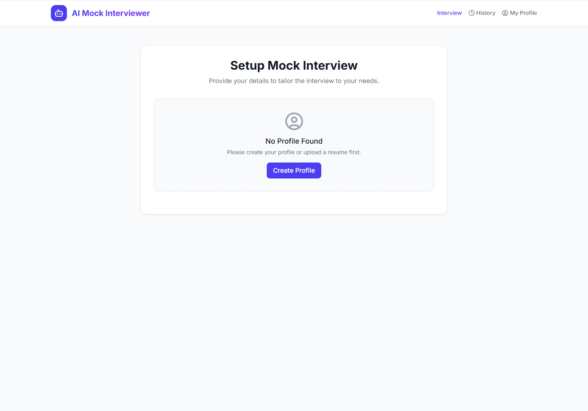
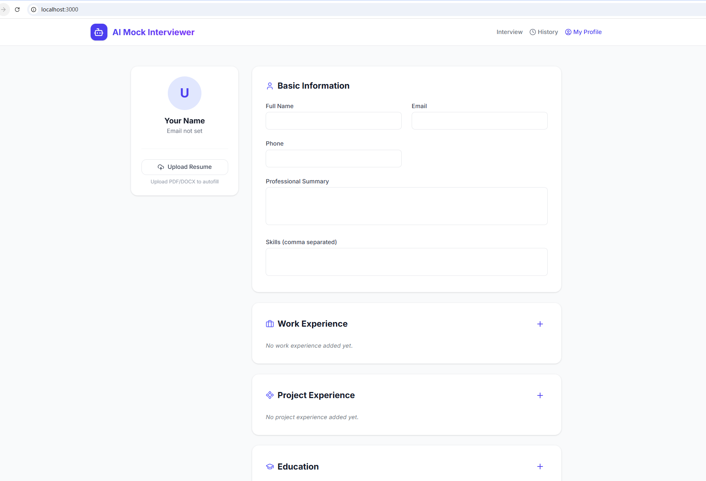
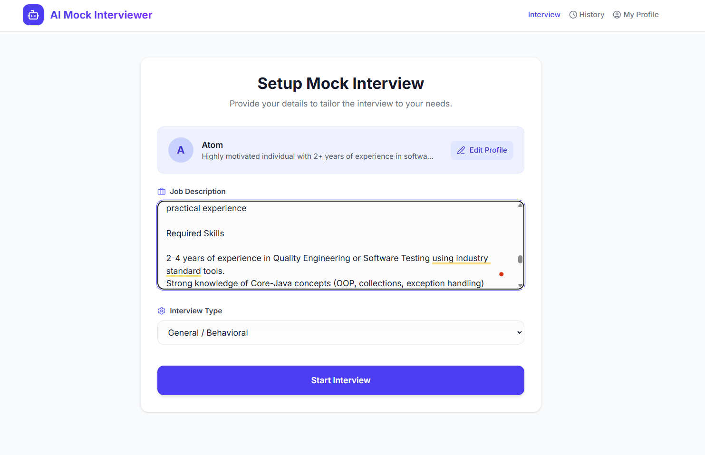
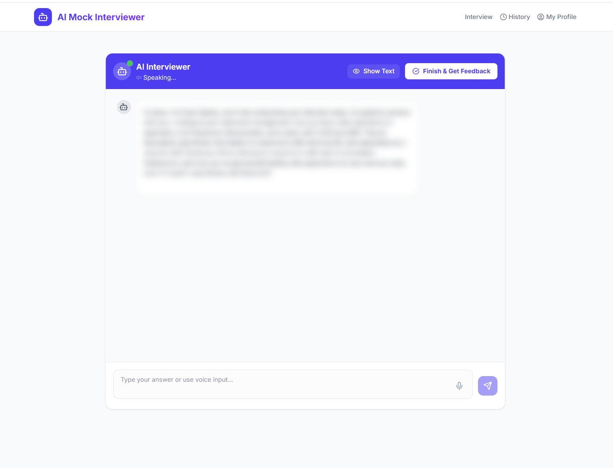
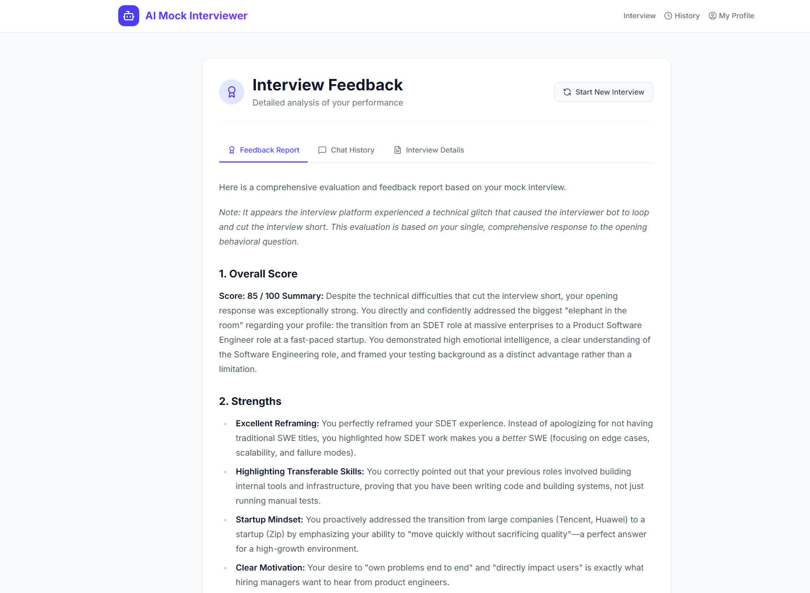

# AI Mock Interviewer

## 📖 Introduction
AI Mock Interviewer is a full-stack web application designed to help job seekers practice and improve their interview skills. Powered by Vue 3 on the frontend, FastAPI on the backend, and Google's Gemini 2.5 AI models, the system dynamically generates personalized interview questions based on your actual resume and the target Job Description (JD). It supports voice interactions and provides comprehensive feedback to help you land your dream job.

## ✨ Key Features
* 📄 **Smart Resume Parsing**: Upload your resume (PDF/DOCX) and let the Gemini AI automatically extract your contact details, skills, work experience, and education to build your profile.
* 🎯 **Tailored Mock Interviews**: Input a Job Description and choose an interview style (General, Technical, System Design, or Product Management). The AI compares your profile against the JD to ask highly relevant, context-aware questions.
* 💬 **Voice & Multimodal Interaction**: Practice speaking naturally! The app features real-time speech recognition for your answers and text-to-speech (Google TTS / Browser Synthesis) so you can hear the AI interviewer.
* 📊 **Comprehensive Feedback Reports**: After finishing the interview, receive a detailed evaluation (powered by Gemini 2.5 Pro) including an overall score, strengths, areas for improvement, specific answer critiques (using the STAR method), and grammar/communication corrections.
* 🕰️ **Local History Management**: All your profiles, chat transcripts, and feedback reports are securely saved in your browser's local storage for easy review and progress tracking.

## 🛠️ Tech Stack
### Frontend
* **Framework**: Vue 3 (Composition API) + TypeScript
* **Build Tool**: Vite
* **Styling**: Tailwind CSS
* **Icons**: Lucide-vue-next
* **Markdown Rendering**: Marked

### Backend
* **Framework**: Python + FastAPI
* **AI Models**: Google GenAI SDK (`gemini-2.5-flash` for chat/parsing, `gemini-2.5-pro` for detailed feedback)
* **Text-to-Speech**: gTTS (Google Text-to-Speech)
* **Environment**: python-dotenv

## 🚀 Getting Started

### 1. Prerequisites
* Node.js (v16 or higher)
* Python (3.8 or higher)
* A Google Gemini API Key

### 2. Setup
Install the required dependencies for the backend:
```bash
pip install -r requirements.txt

```

Create a `.env` file in the `backend` directory and add your Gemini API key:

```env
GEMINI_API_KEY="your_api_key_here"

```
Run the `start.bat` or `start.sh` script to start the frontend and backend server.

Or, you can run the following commands in the terminal:
```bash
cd backend
uvicorn main:app --reload
```
Open a new terminal window and run:
```bash
cd frontend
npm install
npm run dev
```

*(Open the local URL provided in your terminal, `http://localhost:3000`, to use the app)*

## 💡 How to Use

1. **Create a Profile**: Click "My Profile" or the "Create Profile" button on the home page to let the AI auto-fill your background, or edit the fields manually.




2. **Setup the Interview**: Go to the "Interview" setup page, paste the target Job Description, and select your preferred interview type.


3. **Start the Mock Interview**: The AI will initiate the conversation. You can answer by typing in the text box or clicking the microphone icon for voice input.


4. **Get Feedback**: After answering 4-5 questions, it will auto finish or click "Finish & Get Feedback". The AI will generate a detailed performance report.


5. **Review History**: Check the "History" tab to revisit past mock interviews, transcripts, and feedback reports.


